**Relatório de Investigação: Snapped Phish-ing Line**

Este laboratório simula um incidente realista de phishing em ambiente corporativo.
O objetivo foi analisar e-mails maliciosos, identificar a infraestrutura adversária, extrair artefatos do kit de phishing e coletar indicadores de comprometimento (IOCs).

O objetivo deste relatório é descrever passo a passo como cada pergunta do Lab encaminhou a investigação e reforçou os aprendizados das rooms anteriores.

Este LAB foi realizado dentro da máquina virtual da TryHackMe.
---
Contexto do Lab: 

**Isenção de responsabilidade**
**Baseado em ocorrências do mundo real e análises anteriores, este cenário apresenta uma narrativa com nomes, personagens e eventos inventados.**
**Atenção: O kit de phishing usado neste cenário foi obtido de uma campanha de phishing real. Portanto, recomenda-se que a interação com os artefatos de phishing seja feita somente dentro da máquina virtual conectada, pois trata-se de um ambiente isolado.**

Um dia comum de verão...
Como membro da equipe de TI da SwiftSpend Financial, uma de suas responsabilidades é auxiliar seus colegas com suas dúvidas técnicas. Embora tudo parecesse normal e rotineiro, isso mudou gradualmente quando vários funcionários de diferentes departamentos começaram a relatar o recebimento de um e-mail incomum. Infelizmente, alguns já haviam enviado suas credenciais e não conseguiam mais acessar o sistema.

Você então procedeu à investigação do que estava acontecendo através das seguintes etapas:

Analisar as amostras de e-mail fornecidas por seus colegas.

Analisar as URLs de phishing navegando nelas com o Firefox.

Recuperar o kit de phishing usado pelo adversário.

Utilizar ferramentas relacionadas à CTI para coletar mais informações sobre o adversário.

Analisar o kit de phishing para obter mais informações sobre o adversário.

---
Perguntas:

1. Quem é a pessoa que recebeu o anexo de e-mail contendo um arquivo PDF?

Dentro da máquina virtual, podemos verificar a pasta "phish-emails" com os 5 e-mails de phishing recebidos pelos funcionários da empresa fictícia. Podemos ver os arquivos na imagem abaixo:

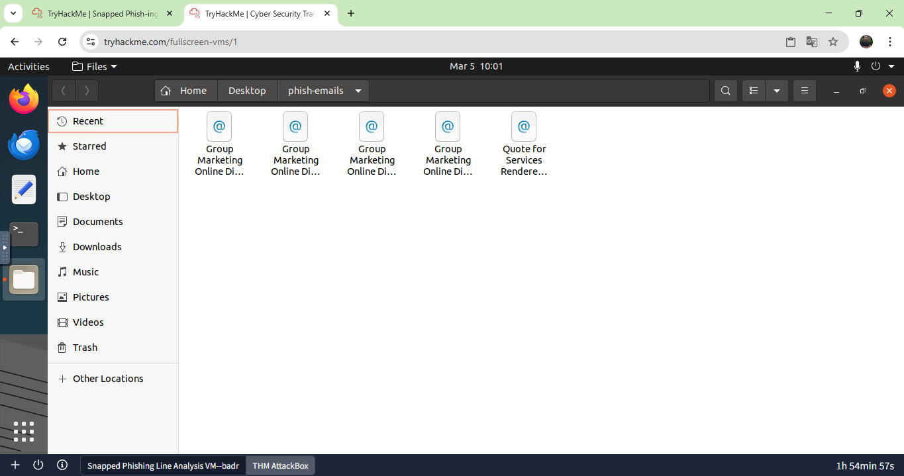

Analisando cada email, chegamos a conclusao que o email que continha o PDF trata-se do **William McClean**!
As setas vermelhas vao facilitar a visualizaçao.

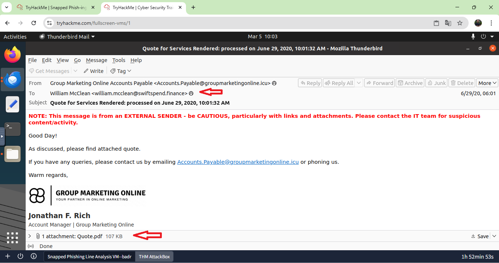

Resposta: William McClean

2. Qual endereço de e-mail foi usado pelo adversário para enviar os e-mails de phishing?

Ao analisar o mesmo e-mail (e também os outros), podemos ver no cabeçalho (From) que foram enviados por Accounts.Payable@groupmarketingonline.icu. (Vale destacar que, logo na primeira análise, trata-se de um e-mail extremamente suspeito).

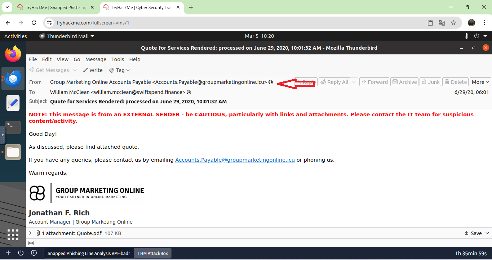

Resposta: Accounts.Payable@groupmarketingonline.icu

3. Qual é o URL de redirecionamento para a página de phishing referente à pessoa Zoe Duncan? (formato desativado)

Aqui iniciamos a análise mais aprofundada. Primeiro, acessamos o e-mail recebido por Zoe Duncan. Analisando o conteúdo, vemos que ela recebeu um anexo diferente de William: Direct Credit Advice.HTML. Não somente ela, mas todos os outros e-mails receberam o mesmo anexo, destacado com uma seta vermelha na imagem abaixo:

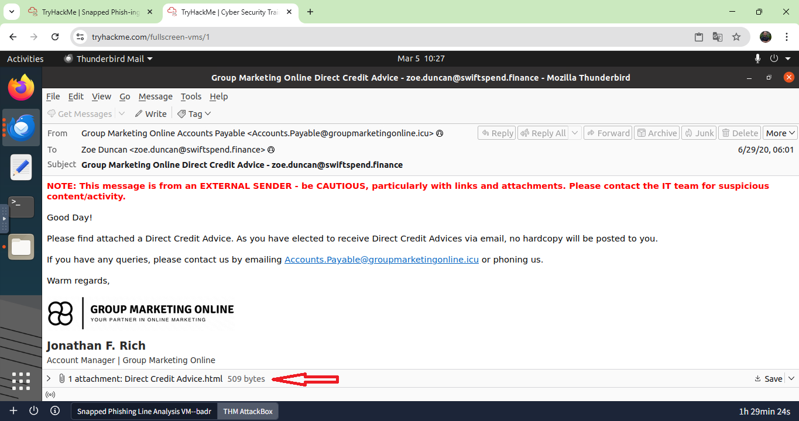

Ao clicarmos no anexo, somos direcionados para uma página falsa do Office que pede a senha da plataforma com o objetivo de roubar as credenciais dos alvos. O domínio utilizado apresenta forte indício de comprometimento, uma vez que não corresponde ao oficial da Microsoft.

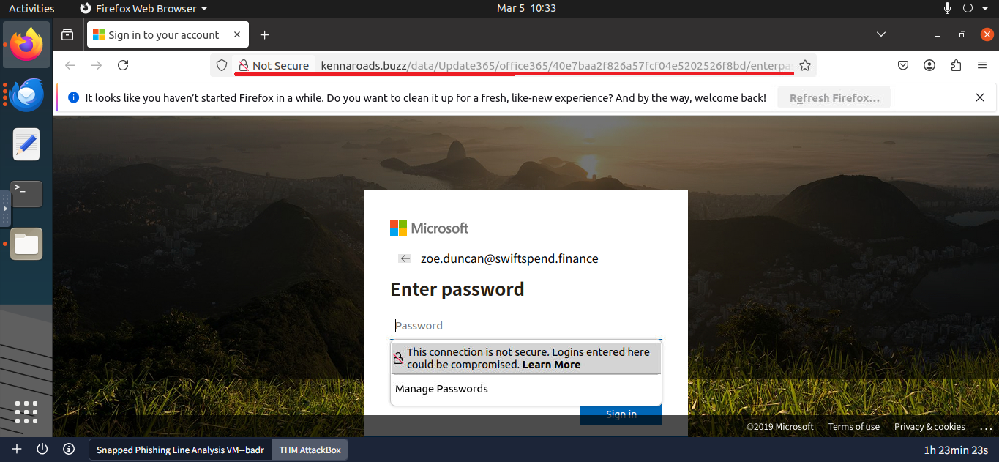

A URL de redirecionamento verdadeira pode ser encontrada ao salvar esse documento na Virtual Machine; ao abri-lo com o editor de texto, podemos visualizá-la:

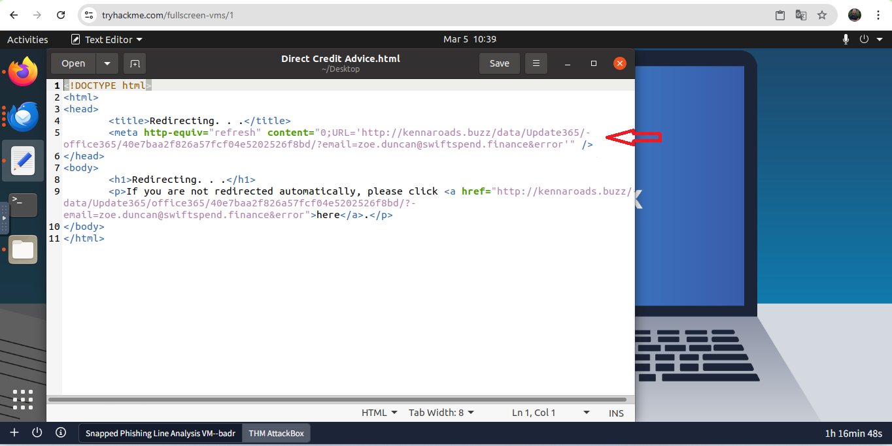

Entretanto, a pergunta pede a URL no formato defang ("formato desativado"), então utilizei o CyberChef para a tarefa:

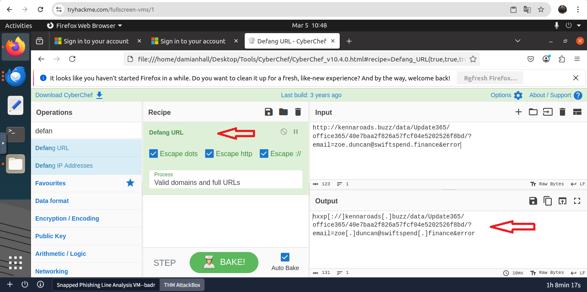

Resposta: hxxp[://]kennaroads[.]buzz/data/Update365/office365/40e7baa2f826a57fcf04e5202526f8bd/?email=zoe[.]duncan@swiftspend[.]finance&error

4. Qual é o URL do arquivo .zip do kit de phishing? (formato desativado)

A dica da sala é enumerar os caminhos da URL. Ao analisarmos a URL, verificamos a parte /data/, indicando uma possível abertura para verificar se o diretório do site está desprotegido. Navegando até o caminho http://kennaroads.buzz/data/, encontramos o index:

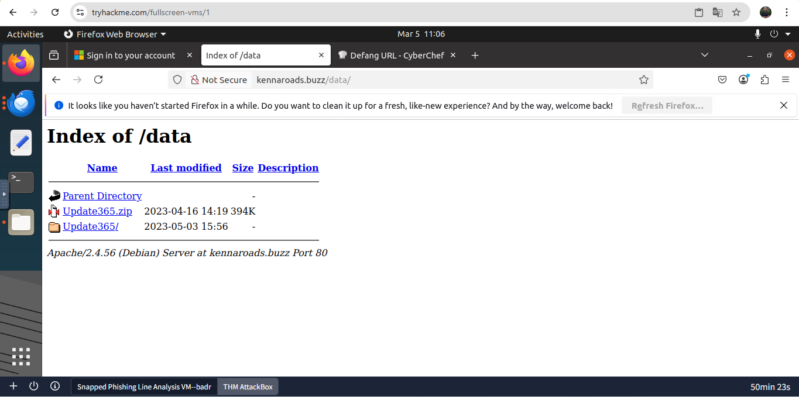

Com acesso ao index, podemos clicar com o botão direito sobre o arquivo .zip, selecionar a opção de copiar o link e colocá-lo no formato defang para responder:

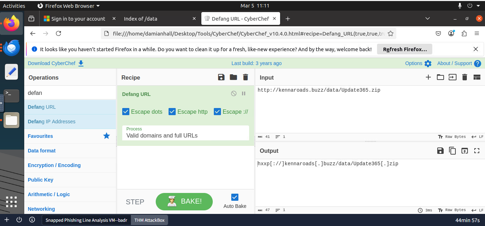

Resposta: hxxp[://]kennaroads[.]buzz/data/Update365[.]zip

5. Qual é o hash SHA256 do arquivo do kit de phishing?

Já que estamos em uma Máquina Virtual, podemos baixar o arquivo Update365.zip e, a partir daí, usar o terminal para descobrir o hash do arquivo com o comando sha256sum Update365.zip.

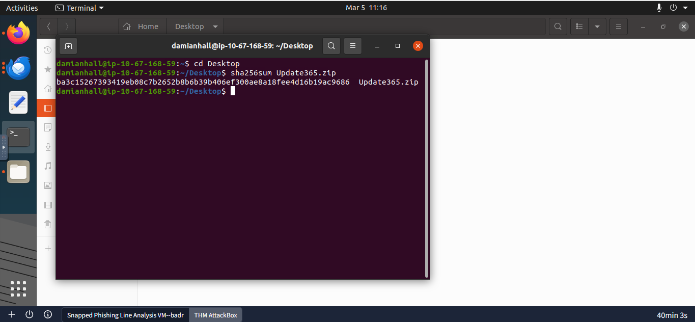

Resposta: ba3c15267393419eb08c7b2652b8b6b39b406ef300ae8a18fee4d16b19ac9686

6. Quando o arquivo do kit de phishing foi enviado pela primeira vez? (formato: AAAA-MM-DD HH:MM:SS UTC)

Seguindo a dica do LAB, que orienta o uso de uma ferramenta de código aberto, utilizei o VirusTotal para investigar o arquivo a partir do seu hash. Na seção Details, podemos verificar a data do seu primeiro envio (informação grifada em vermelho):

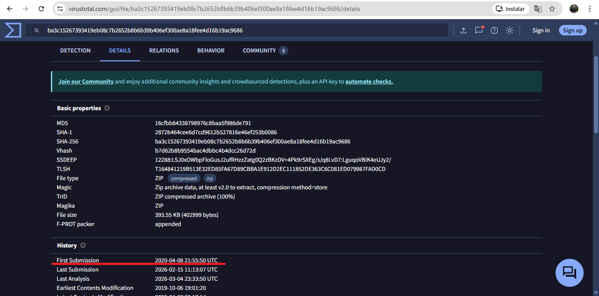

Um adendo: apesar da história simulada, a própria plataforma alerta sobre o uso de arquivos realmente maliciosos. Deixarei o link do VirusTotal para confirmação da análise: Se um dia receber algo semelhante, não interaja com o arquivo!
Link: https://www.virustotal.com/gui/file/ba3c15267393419eb08c7b2652b8b6b39b406ef300ae8a18fee4d16b19ac9686/detection

Resposta: 2020-04-08 21:55:50 UTC

7. Quando o certificado SSL usado pelo domínio de phishing para hospedar o arquivo do kit de phishing foi registrado pela primeira vez? (formato: AAAA-MM-DD)

Esta pergunta contém a resposta na dica, pois a justificativa da plataforma é: "O certificado SSL não está mais disponível para responder a esta pergunta com segurança."

Resposta: 2020-06-25

Reforço o alerta: não interaja com arquivos ou domínios fora de um ambiente controlado.

8. Qual era o endereço de e-mail do usuário que enviou sua senha duas vezes?

Ao analisarmos o index encontrado anteriormente, podemos navegar até a pasta office365/. Lá encontraremos um arquivo chamado log.txt, onde estão sendo registradas as senhas das vítimas que tentaram acessar suas contas Microsoft. Verifiquei que michael.ascot@swiftspend.finance foi o responsável por enviar a senha duas vezes.

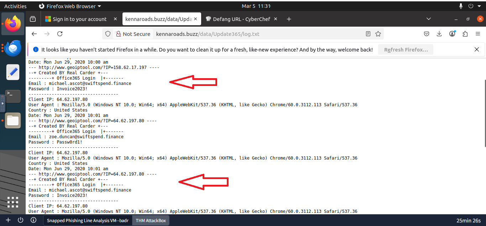

Resposta: michael.ascot@swiftspend.finance

9. Qual foi o endereço de e-mail usado pelo adversário para coletar as credenciais comprometidas?

Navegando até a página inicial para a qual o anexo redireciona os alvos, podemos inspecioná-la para verificar o código e entender como funciona o envio. Verificamos que a ação é realizada por um arquivo chamado submit.php.

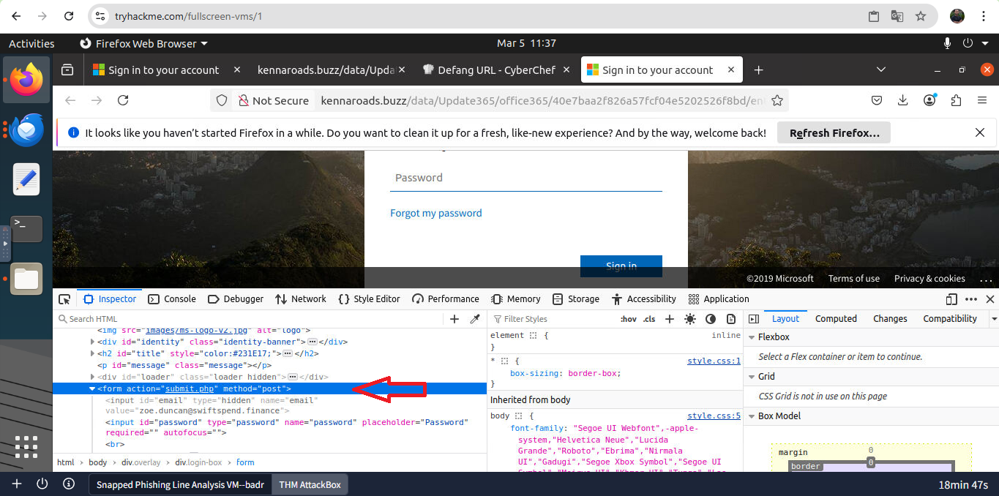

Analisando o arquivo Zip baixado anteriormente, encontrei este arquivo dentro do diretório /Validation, localizando o e-mail que está sendo usado para coletar as credenciais.

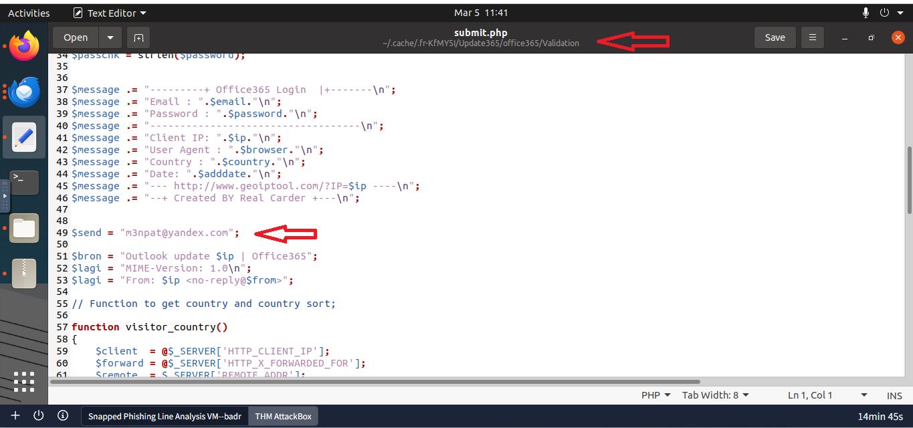

Resposta: m3npat@yandex.com

10. O adversário utilizou outros endereços de e-mail no kit de phishing obtido. Qual é o endereço de e-mail que termina em "@gmail.com"?

Analisei outros arquivos no zip e, em muitos deles, é possível encontrar o Gmail solicitado.

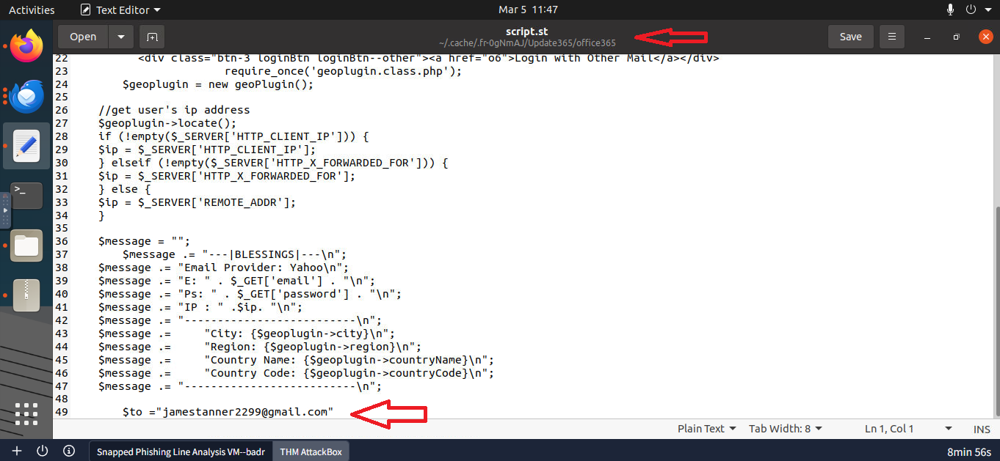

11. Qual é a bandeira (flag) oculta?

Dica da sala: "o arquivo malicioso tem a extensão '.txt' e, com alguns ajustes, pode ser baixado da URL de phishing. Procure o arquivo em todos os subdomínios/diretórios da URL de phishing."

Tentei realizar a enumeração com alguns comandos no terminal, entretanto, é costume da TryHackMe deixar a flag em um subdiretório /flag.txt. Ao verificar http://kennaroads.buzz/data/Update365/office365/flag.txt, encontrei a flag codificada em Base64.

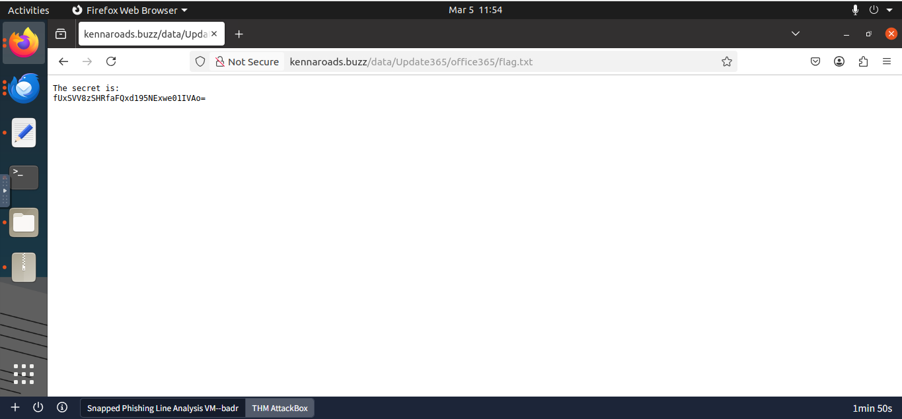

Novamente com o auxílio do CyberChef, decodifiquei a informação. A flag estava ao contrário, então utilizei a função "Reverse" junto com "From Base64".

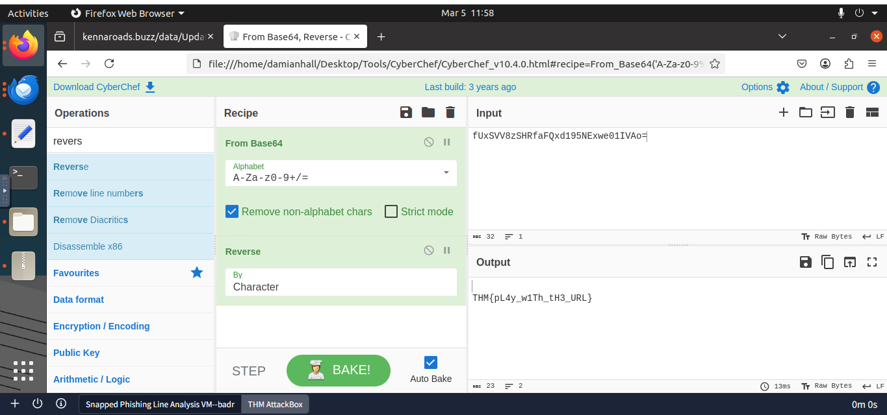

Resposta: THM{pL4y_w1Th_tH3_URL}

Laboratorio concluido!

---
## Indicadores de Comprometimento (IOCs)

### Domínios
- hxxp[://]kennaroads[.]buzz

### E-mails maliciosos
- Accounts.Payable@groupmarketingonline.icu
- m3npat@yandex.com

### Hashes
- SHA256: ba3c15267393419eb08c7b2652b8b6b39b406ef300ae8a18fee4d16b19ac9686

### Arquivos
- Update365.zip

